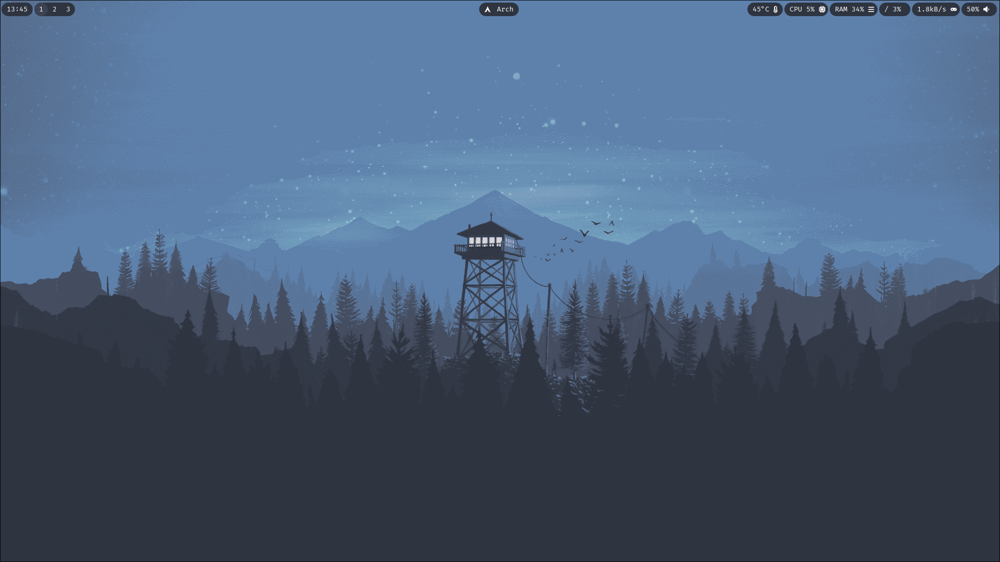
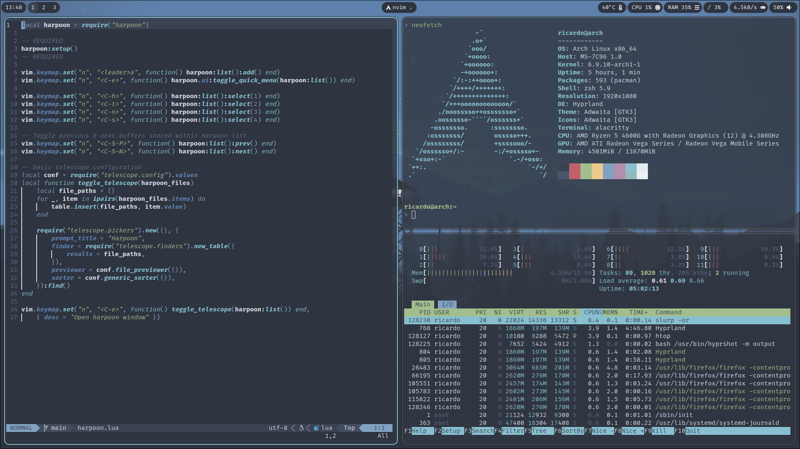

# Dot Files - Hypr Config

 

 

# Details
- **OS**: Arch Linux
- **Compositor**: [Hyprland](https://github.com/hyprwm/Hyprland)
- **Top Bar**: [Waybar](https://github.com/Alexays/Waybar)
- **Terminal**: [Alacritty](https://github.com/alacritty/alacritty)
- **Search menu**: [Wofi](https://hg.sr.ht/~scoopta/wofi)
- **Themes**: [Nord](https://github.com/nordtheme/nord)
